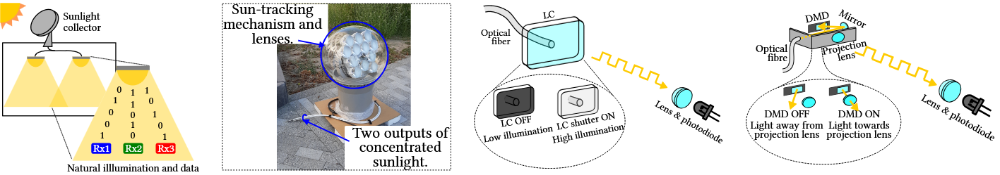

<picture>
  
</picture>

---

    <h1>Sol-Fi: Enabling Joint Illumination and Communication in Enclosed Areas with Sunlight</h1>

This repo contains the code to build the Sol-Fi system. The two configurations of the system are single-channel and dual-channel.

* **Single-channel** uses only one LC or DMD at the output of the Sunlight Collector.
* **Dual-channel** uses dichroic filters to divide the output of the Sunlight Collector into two colour channels, which are then recombined to provide illumination.

The repo organisation is:
* **Arduino**: folder that contains the Arduino code to drive the LCs.
* **FPGA**: folder that contains the Artix 7 code to drive the DMD controller board to provide the electrical signals to the DMD.
* **Python**: folder that contains the Python code used to decode the FSK signal.

## Requirements
* The system uses the [XD-50S/12AS Himawari Sunlight Collector](https://himawarisolar.com/himawari-solar-natural-lighting-system/product-specification/).
* If using dual-channel configuration, the dichroic filter must be in place.
